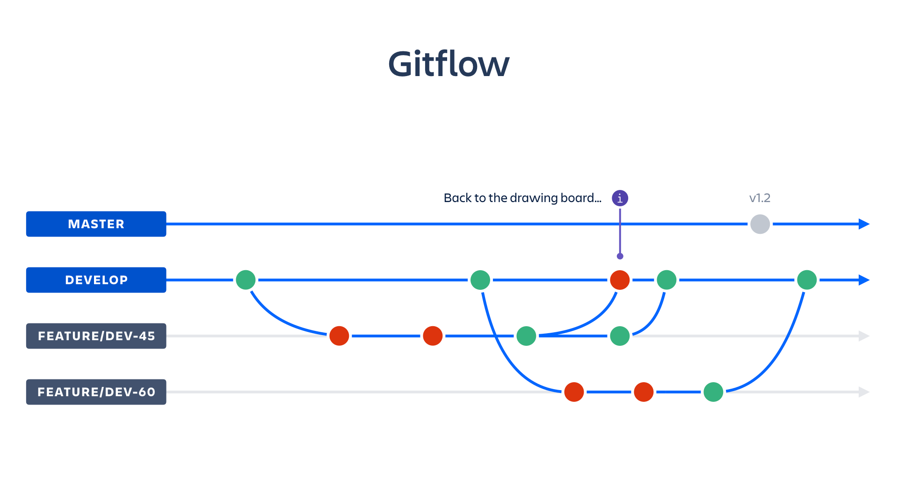

# Metodología organizacional SCROM:
> SCROM: Soft Coders Realistic Organisational Model

 

---
## Github
El workflow base es **gitflow**, modificando la rama "develop" por la rama "entrega-x".

---
## Pull Requests:
- Todo merge a *main* y *entrega-x* debe de hacerse mediante *pull request*.
- En el caso de un PR para *main* deberá ser revisado y aprobado por *todo* el equipo.
- Opcionalmente se pueden crear *pull requests* para *feature branches* que contengan *sub-features* en las que trabajen varias personas.

### Nomenclatura:
- Se requiere que **todos** los integrantes del grupo revisen y acepten el *pull request* para realizar el *merge*:  
  - `MAJOR -> <Pull Request Name>`  
    `@member1 @member2 @member3 ...`  
- Se requiere que **alguno** los integrantes citados **en el comentario** revise y acepte el *pull request* para realizar el *merge*.
  - `MINOR -> <Pull Request Name>`  
    `@member1 @member2 @member3 ...`  
- Se requiere que **solo** los integrantes citados **en el comentario y título** revisen y acepten el *pull request* para realizar el *merge*.
  - `<member name> -> <Pull Request Name>`  
    `@member1 @member2 @member3 ...`  

### Aprobación de Pull Requests
- Síncrono:
  - Reunión de las personas implicadas para aprobar el pull request.
- Asíncrono:
  - Se revisa de manera individual y se comenta si se aprueba o no el request.
  - Cuando la decisión no sea unánime se discute con el resto de implicados si se aprueba o no.

---
## Comeets
> Las *coomets* son reuniones surgidas como resultado de unificar los workflows a seguir en sprint reviews y scrum meetings.

El procedimiento a seguir es el siguiente:
1. Actas.
	- Exposición individual de respuestas a las dos preguntas básicas:
		- ¿Qué has hecho hasta ahora?
		- ¿Con qué problemas te has encontrado?
	- Unificación de las actas (a realizar por el Comeeter).
2. Resolución de Pull Requests pendientes.
3. Lista de temas.
	- Establecer las cuestiones a tratar en la reunión
	- Debatir cada uno de los puntos de la lista de forma ordenada hasta solucionarlos
4. Asignar tareas: establecer fecha y encargado.

### Resolución de conflictos entre Comeets
- Solo altera mi trabajo:
  - Se puede informar mediante Discord o Whatsapp
  - Lo resuelve la persona implicada de manera independiente.
- Altera el trabajo de alguien más:
  - Muy grave:
    1. Crea un Issue en GitHub.
    2. Notifaca a las personas implicadas directamente.
    3. Se establece reunión de emergencia entre las personas implicadas para resolver el conflicto.
  - Moderadamente grave:
    1. Crea un issue en GitHub tageando a las personas implicadas, tanto en título como en cuerpo.
    2. Se resuelve de manera asícrona cuando sea posible.
  - Nada grave:
    1. Se notifica por el canal general de Discord o Whatsapp (opcional).
    2. Se discute en el próximo SCRUM preferiblemente.
