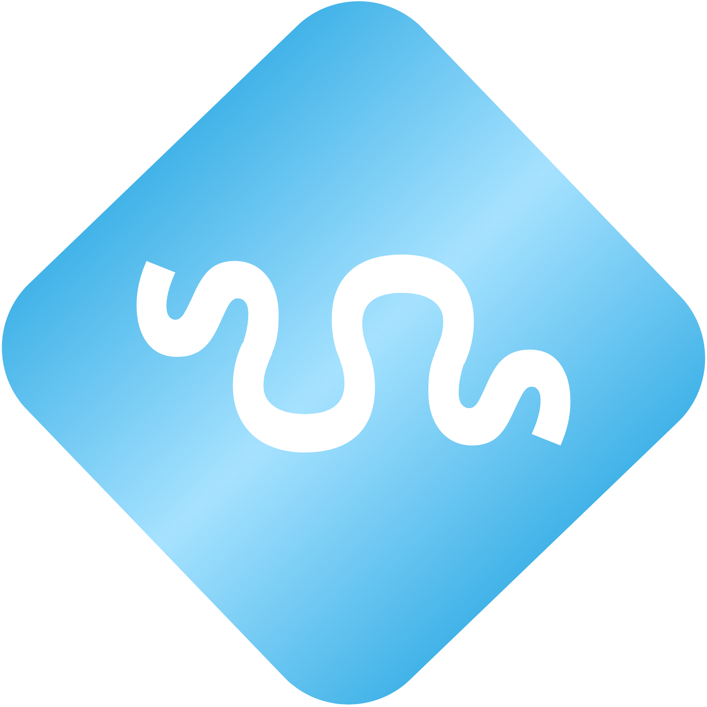

<h1 align="left" >
 	
	SoftCoders
</h1>

## Metodología organizacional SCROM
> **SCROM**: Soft Coders Realistic Organizational Model
### Distribución del trabajo
> En este proyecto se han dividido los períodos de entregas en 2 subsecciones con objetivos diferentes para maximizar la eficiencia.
- Master period: Subsección inicial del período de entrega. El objetivo es comprender todos los aspectos teóricos necesarios para realizar la entrega de forma satisfactoria.
- Development period: Subsección final del período de entrega. El objetivo es centrar la atención y esfuerzos en desarrollar el producto requerido para la entrega.
### COMEETS
> Las *COMEETS* son reuniones surgidas como resultado de unificar los workflows a seguir en sprint reviews y scrum meetings.
El procedimiento a seguir es el siguiente:
1. Actas.
	- Exposición individual de respuestas a las dos preguntas básicas:
		- ¿Qué has hecho hasta ahora?
		- ¿Con qué problemas te has encontrado?
	- Unificación de las actas (a realizar por el Comeeter).
2. Resolución de Pull Requests pendientes.
3. Lista de temas.
	- Establecer las cuestiones a tratar en la reunión.
	- Debatir cada uno de los puntos de la lista de forma ordenada hasta solucionarlos.
4. Asignar tareas: establecer fecha y encargado.
#### Resolución de conflictos entre COMEETS
- Solo altera mi trabajo:
  - Se puede informar mediante Discord o Whatsapp.
  - Lo resuelve la persona implicada de manera independiente.
- Altera el trabajo de alguien más:
  - Muy grave:
    1. Crea un Issue en GitHub.
    2. Notifaca a las personas implicadas directamente.
    3. Se establece reunión de emergencia entre las personas implicadas para resolver el conflicto.
  - Moderadamente grave:
    1. Crea un issue en GitHub tageando a las personas implicadas, tanto en título como en cuerpo.
    2. Se resuelve de manera asícrona cuando sea posible.
  - Nada grave:
    1. Se notifica por el canal general de Discord o Whatsapp (opcional).
    2. Se discute en el próximo COMEET preferiblemente.
---

## License

Licensed under the [MIT License](LICENSE).

---

 

<h1 align="center" >
 	
	
	SoftCoders
</h1>
